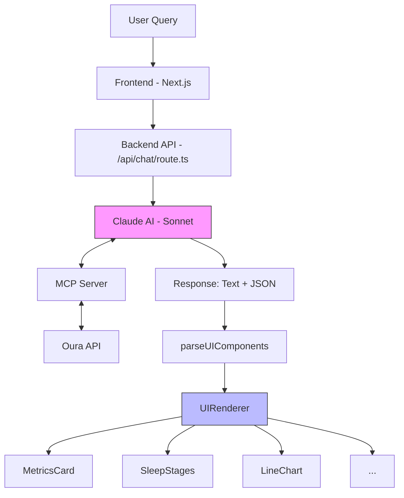

# Generative UI Architecture in Oura GenUI

This application implements a **JSON-driven generative UI system** where Claude AI generates UI component definitions that get rendered as React components.

## Core Flow

```
User Query → Claude AI (with MCP tools) → Fetches Oura data → Generates JSON UI spec → UIRenderer → React Components
```

## Key Implementation Details

### 1. System Prompt as UI Contract

**File:** `src/app/api/chat/route.ts`

The system prompt defines 7 available component types with JSON schemas that Claude must follow:

| Component | Purpose |
|-----------|---------|
| `metrics_card` | Key metrics with icons and trends |
| `sleep_stages` | Stacked bar chart of sleep phases |
| `line_chart` | Time-series visualization |
| `readiness_breakdown` | Score with contributors |
| `stat_comparison` | Current vs previous values |
| `sleep_timeline` | Visual sleep stage timeline |
| `empty_state` | No data available state |

### 2. UIRenderer

**File:** `src/components/oura/UIRenderer.tsx`

A switch-based renderer that maps JSON `type` field to actual React components:

```typescript
switch (component.type) {
  case 'metrics_card': return <MetricsCard {...component} />
  case 'sleep_stages': return <SleepStages {...component} />
  case 'line_chart': return <LineChart {...component} />
  case 'readiness_breakdown': return <ReadinessBreakdown {...component} />
  case 'stat_comparison': return <StatComparison {...component} />
  case 'sleep_timeline': return <SleepTimeline {...component} />
  case 'empty_state': return <EmptyState {...component} />
}
```

### 3. JSON Extraction

**Function:** `parseUIComponents()` in `src/components/oura/UIRenderer.tsx`

Extracts JSON from Claude's response (which wraps it in markdown code blocks):

```typescript
const jsonMatch = response.match(/```json\n?([\s\S]*?)\n?```/)
const jsonString = jsonMatch ? jsonMatch[1] : response
const parsed = JSON.parse(jsonString)
```

### 4. MCP Server

**File:** `mcp-server/src/index.ts`

Provides Claude with tools to fetch Oura Ring data while filtering responses to reduce token usage:

- `get_sleep_data` - Sleep metrics, stages, efficiency, heart rate
- `get_activity_data` - Steps, calories, active time
- `get_readiness_data` - Readiness scores and contributors
- `get_heart_rate_data` - Heart rate throughout the day
- `get_workout_data` - Workout and exercise sessions

## Generative vs Deterministic: Where the "AI" Actually Happens

A key architectural distinction: **Claude is the generative intelligence**, while the **UIRenderer is purely deterministic**.

### Claude's Role (Generative)

Claude augments the raw MCP data significantly:

1. **Fetches** raw data via MCP tools (e.g., `get_sleep_data` returns JSON with fields like `total_sleep_duration: 26460` in seconds)
2. **Interprets** the data - understands what it means in context of the user's question
3. **Transforms** values - converts raw numbers to human-friendly formats (e.g., `26460` → `"7h 21m"`)
4. **Selects** which components to use based on what would best visualize the data
5. **Structures** the output as JSON matching the component schemas defined in the system prompt

### UIRenderer's Role (Deterministic)

The `UIRenderer` is purely deterministic - it's just a switch statement that maps `type` strings to React components:

```typescript
switch (component.type) {
  case 'metrics_card': return <MetricsCard ... />
  case 'sleep_stages': return <SleepStages ... />
  // ...
}
```

No AI involved in rendering - it's a direct type → component lookup.

### Responsibility Breakdown

| Stage | Owner | Type | Description |
|-------|-------|------|-------------|
| Data fetching | MCP Server | Deterministic | Raw Oura API data |
| Data interpretation | Claude | **Generative** | Understands meaning and relevance |
| Component selection | Claude | **Generative** | Decides which UI types best fit the data |
| Data transformation | Claude | **Generative** | Formats values, extracts relevant fields |
| JSON generation | Claude | **Generative** | Outputs structured component definitions |
| Component rendering | UIRenderer | Deterministic | Maps type strings to React components |

This separation means Claude handles all the intelligence (what to show, how to structure it), while the frontend simply renders pre-built components based on the JSON specification.

## Example Response from Claude

```
Based on your sleep data, you got excellent rest last night...

```json
[
  {
    "type": "metrics_card",
    "title": "Last Night's Sleep",
    "metrics": [
      { "label": "Total Sleep", "value": "7h 21m", "icon": "moon", "trend": "up" }
    ]
  },
  {
    "type": "sleep_stages",
    "deep": 70, "rem": 68, "light": 302, "awake": 15
  }
]
```
```

## Key Design Patterns

| Pattern | Purpose |
|---------|---------|
| **Union Types** | TypeScript ensures type safety for all component variations |
| **Tool-First Architecture** | Claude uses MCP tools rather than direct API access |
| **Streaming** | Vercel AI SDK streams responses for responsive UX |
| **Data Filtering** | MCP server trims API responses to reduce token usage |

## Data Flow Diagram



**Flow:**
1. User sends a query via the chat interface
2. Frontend passes message to backend API route
3. Claude receives the message with system prompt defining UI components
4. Claude calls MCP tools to fetch Oura data
5. Claude interprets data, selects components, generates JSON
6. Frontend extracts JSON with `parseUIComponents()`
7. `UIRenderer` deterministically maps `type` → React component

## Summary

The architecture creates a clean separation: Claude decides *what* to show based on user queries and data, while the pre-built React components handle *how* to display it. This enables natural language-driven UI generation while maintaining type safety, data privacy, and a smooth user experience.
